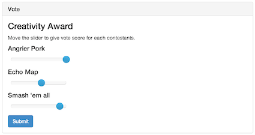
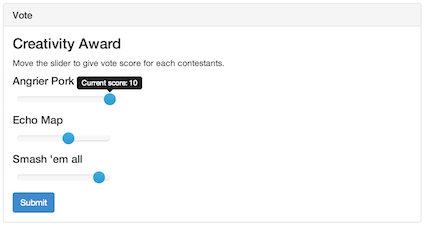

Use Case Name
-------------
Contestant Vote

XRef
----
[UC201](https://github.com/AKWEXV/exceedvote_ws/blob/master/use-cases/uc201-contestant-vote.md), [Requirement](https://github.com/AKWEXV/exceedvote_ws/wiki/Requirement)

High Level Design
-----------------
Purpose

* User will be able to view criterion.
* User will be able to choose score for each contestants.
* User will be able to submit their vote.

There will be 4 components

* Criterion information
* Contestants score selection (slider)
* Submit button
* Successful message panel (initial invisible)

The submit button, when clicked, will check user contestants selection and submit user vote to the database. System redirect user to vote page with successful panel visible.

Low Level Design
----------------

* Criterion information
    * Display criterion name.
* Contestants score selection
    * Display contestant name and slider for user to choose score for give to contestant (show number of contestants times).
    * Slider show current score when user have activity with it.
    * Sort by: Contestant's ID.
* Submit button
    * Display for user to click to submit their vote.
* Successful message panel
    * Display after vote success, show vote information.

| Component Name | ID | Name |
| -------------- | -- | ---- |
| TO-BE-ADDED | TO-BE-ADDED | TO-BE-ADDED |