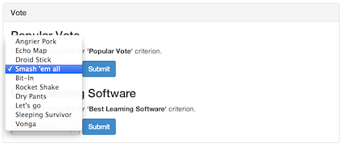

Use Case Name
-------------
Criterion Vote

XRef
----
[UC202](https://github.com/AKWEXV/exceedvote_ws/blob/master/use-cases/uc202-criterion-vote.md), [Requirement](https://github.com/AKWEXV/exceedvote_ws/wiki/Requirement)

High Level Design
-----------------
Purpose

* User will be able to view criterion.
* User will be able to choose contestant for each criterion.
* User will be able to submit their vote.

There will be 4 components

* Criterion information
* Contestant selection
* Submit button
* Successful message panel (initial invisible)

The submit button, when clicked, will check user contestant selection and submit user vote to the database. System redirect user to vote page with successful panel visible.

Low Level Design
----------------

* Criterion information
    * Display criterion name.
    * Display number of votes user have left.
    * Display number of criterion times.
    * Sort by: Criterion's ID.
* Contestants selection
    * Display form select with all contestants name as option for user to choose.
* Submit button
    * Display for user to click to submit their vote.
* Successful message panel
    * Display after vote success, show vote information.

| Component Name | ID | Name |
| -------------- | -- | ---- |
| TO-BE-ADDED | TO-BE-ADDED | TO-BE-ADDED |